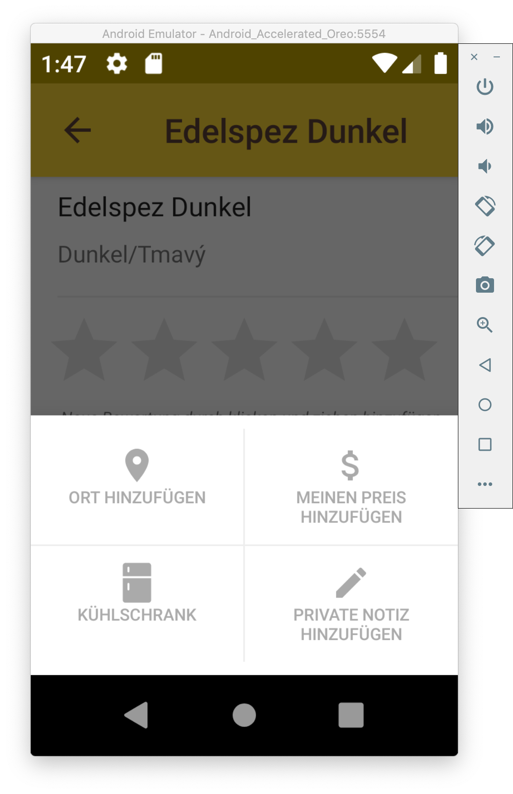
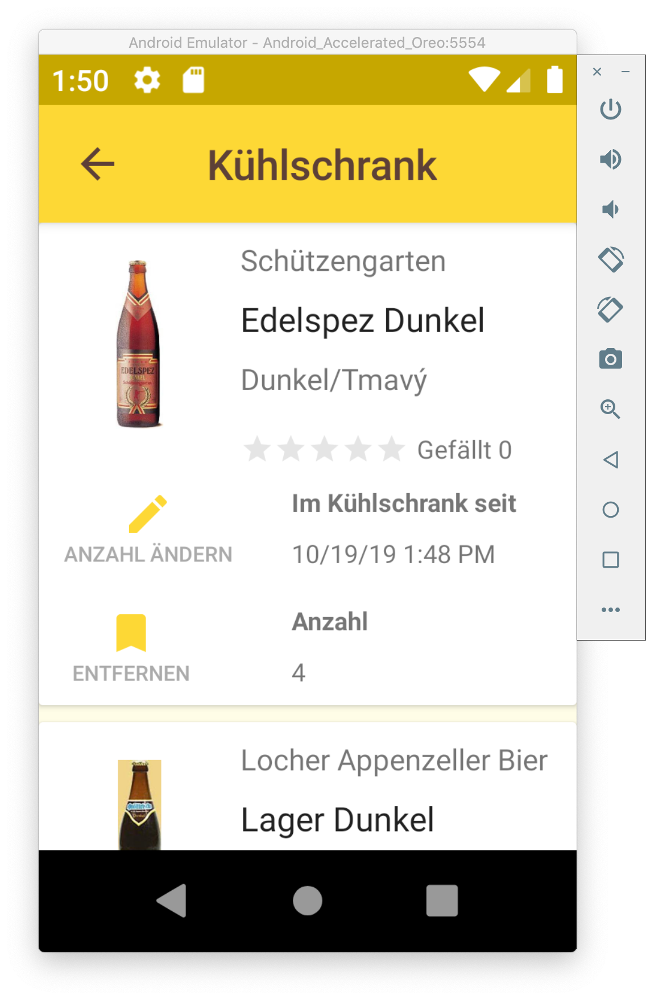

# Testat Übung: BeerPro

## Informationen

- **Team:** Jan Huber (Gruppe 16)
- Eingebaute Funktionen: Kühlschrank (4 PT), Hintergrundbilder (1PT)

## Eingebaute Funktionalität

### Bilder dynamisch von der Datenbank laden

- **Video:**: [Zum Video (Google Drive)](https://drive.google.com/open?id=1_NcXVZ-5I1EcT6F9dqhv9p58DOFrptrm)

- Bilder können pro Hersteller im Firebase-Storage abgelegt werden
- Beim Starten der App werden zuerst Platzhalterbilder angezeigt und dann dynamisch die hinterlegten Bilder vom Firebase Storage geladen

### Bier-Details: Biere zum Kühlschrank hinzufügen und entfernen 

- **Video:**: [Zum Video (Google Drive)](https://drive.google.com/open?id=11tIFl2mVYPUhuOw7f4asxUfE16okokEG)

- Für den Kühlschrank wurde in der Firebase Datenbank eine neue Sammlung `fridgeitems` erstellt
- Der Benutzer kann auswählen, wie viele Biere er zum Kühlschrank hinzufügen will
- Biere können vom Kühlschrank entfernt werden, in dem der Toggle-Button ein zweites mal geklickt wird

### Meine Biere:  Biere zum Kühlschrank hinzufügen und entfernen 

- **Video:**: [Zum Video (Google Drive)](https://drive.google.com/open?id=1Lw7aKcrwyEcMCgtst1hRkoLrJGNmGFvZ)

- In der Ansicht „Meine Biere“ können Biere mittels Button-Klick zum Kühlschrank hinzugefügt oder vom Kühlschrank entfernt werden

### Kühlschrank: Liste

- **Video:**: [Zum Video (Google Drive)](https://drive.google.com/open?id=1BHFXT1jxGgHzS2GLJNJ-QIliN_NQH17T)

- In der Kühlschrank-Liste lassen sich die Biere wieder aus dem Kühlschrank entfernen oder die Anzahl der Biere im Kühlschrank anpassen
- Biere können vom Kühlschrank entfernt werden, in dem der Toggle-Button ein zweites mal geklickt wird oder indem die Anzahl der Biere im Kühlschrank auf „0“ gesetzt wird.

### Biere von der Wunschliste in den Kühlschrank verschieben

- **Video:**: [Zum Video (Google Drive)](https://drive.google.com/open?id=1Oc6nxTtk5UrgngNIUCPgytdp1PML8Ch3)

- Biere können von der Wunschliste direkt in den Kühlschrank verschoben werden. Dabei wird das Bier aus der Wunschliste entfernt.

### Biere verwalten in „Meine Biere “

- **Video:**: [Zum Video (Google Drive)](https://drive.google.com/open?id=1xRwAzY_nrUpD2EZDZT3_cQJyEg5yxF8U)

- In der Ansicht „meine Biere„ werden sämtliche Biere aus dem Kühlschrank, aus der Wunschliste und Biere mit Bewertungen angezeigt (in dieser Reihenfolge)
- Biere werden nur ein einziges mal angezeigt (wenn sie Beispielsweise im Kühlschrank sind und gleichzeitig eine Bewertung haben)

